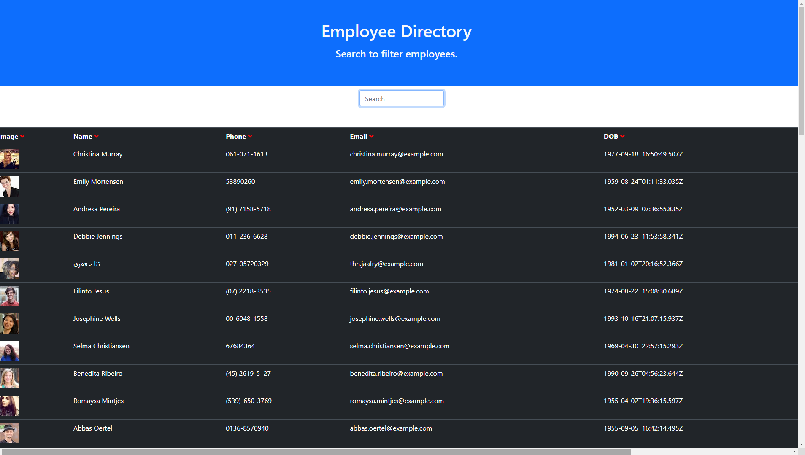

# Employee Directory

## Table of Contents

* [1. License](#License)
* [2. Description](#description)
* [3. Technologies](#Technologies)
* [4. Installation](#Installation)
* [5. Deployment](#Deployment)
* [6. Contributions](#Contributions)
* [7. Support](#Support)
  
  
## License 
  * MIT, to view License information click the badge below!
  * 
  
  
  
  
## Description 
    * The goal was to create a searchable Employee Directory in React.js. The employee data is generated from the https://randomuser.me API
  
  
  

## Technologies 
  
    * React.js
    * JavaScript
    * Bootstrap
    * Markdown
  
 

## Installation 
  
    * To install the dependencies run npm i in the command line.

## Deployment

[Github Pages](https://oconnor97.github.io/employee-directory/)

  
  
## Contributions 
    I am the sole contributer on this project.
  
  
## Support
  
  If you have any questions contact Michael, at moconnor0813@gmail.com or on github at https://github.com/oconnor97
  
  